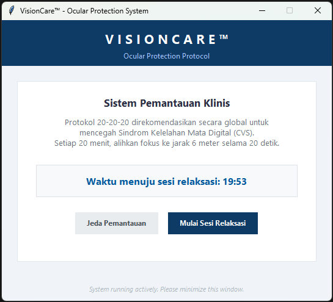

# VisionCare™ - Ocular Protection System

*(Read this in other languages: [English](README_EN.md) | **Bahasa Indonesia**)*

  

**VisionCare™** adalah utilitas klinis desktop yang dirancang khusus untuk mencegah *Computer Vision Syndrome* (CVS) atau Sindrom Kelelahan Mata Digital. Aplikasi ini beroperasi berdasarkan **Protokol 20-20-20** yang direkomendasikan secara medis secara global.

## 🩺 Mengapa Anda Membutuhkan Ini?
Paparan sinar layar terus-menerus dapat menyebabkan kelelahan otot mata, mata kering, dan sakit kepala tegang. Protokol 20-20-20 adalah intervensi medis lini pertama yang paling diakui:
> *"Setiap 20 menit menatap layar, alihkan pandangan Anda ke objek sejauh 20 kaki (sekitar 6 meter) selama 20 detik."*

## ✨ Fitur Utama
- **Automasi Latar Belakang (Background Service):** Berjalan di latar belakang tanpa memberatkan performa komputer Anda.
- **Interupsi Layar Klinis (Full Screen Override):** Mengambil alih layar secara otomatis setiap 20 menit untuk memastikan Anda benar-benar mengistirahatkan mata.
- **Smart Timer & Audio Cues:** Menghitung waktu mundur 20 detik secara presisi dan membunyikan notifikasi audio saat sesi telah selesai.
- **One-Click Installer:** Dilengkapi sistem *Auto-Python Installer* yang akan memeriksa, mengunduh, dan memasangkan segala kebutuhan sistem di PC baru secara otomatis.

---

## 🚀 Panduan Instalasi (Untuk PC Baru)

Anda dapat dengan mudah mendistribusikan aplikasi ini ke berbagai PC/Laptop di kantor atau rumah Anda.

1. Salin seluruh direktori/folder aplikasi ini ke PC tujuan Anda.
2. Buka folder tersebut.
3. Klik dua kali (double-click) pada file instalasi pintar: **`Install_AutoStart.bat`**.
4. Skrip akan memproses instalasi secara mandiri:
   - Mengecek *System Requirements* (Python Environment).
   - Jika sistem belum memenuhi syarat, ia akan **mengunduh dan meng-install Python secara latar belakang** (membutuhkan koneksi internet). *Catatan: Jika muncul jendela konfirmasi Windows (UAC), silakan klik "Yes".*
   - Mendaftarkan VisionCare™ ke dalam *Registry Startup Windows*.
5. Setelah proses selesai dan muncul konfirmasi sukses, tekan tombol apa saja untuk keluar. VisionCare™ sudah aktif dan akan selalu menyala otomatis di komputer tersebut!

---

## 💻 Cara Penggunaan Sehari-hari

- **Secara Otomatis:** Setelah instalasi di atas, Anda tidak perlu melakukan apa-apa lagi. Setiap kali komputer dihidupkan, VisionCare™ akan langsung berjaga-jaga melindungi mata Anda.
- **Secara Manual:** Jika Anda baru saja mematikan aplikasinya dan ingin menyalakannya kembali tanpa me-restart PC, cukup klik dua kali pada file **`OcularCareLauncher.bat`**.

Saat aplikasi berjalan, Anda akan melihat sebuah jendela kontrol utama (Dashboard). Anda disarankan untuk **Minimize (Perkecil)** jendela tersebut (tombol minus di sudut kanan atas) agar tidak menutupi area kerja Anda. Sistem pengingat tetap berjalan dengan baik di latar belakang.

### Kontrol Manual pada Dashboard:
- **Jeda Pemantauan:** Gunakan fungsi ini untuk menangguhkan sementara timer 20 menit. Sangat berguna jika Anda sedang berada di tengah-tengah presentasi virtual, bermain game kompetitif, atau kegiatan kritis lainnya yang tidak boleh ditutup layarnya.
- **Mulai Sesi Relaksasi:** Jika Anda merasakan ketegangan pada mata (mata perih/berair) sebelum timer habis, klik tombol ini untuk memicu sesi pemulihan 20 detik saat itu juga.

---

## 🗑️ Prosedur Pencabutan (Uninstallation)

Jika Anda ingin menonaktifkan aplikasi ini agar tidak lagi menyala otomatis di PC tersebut:
1. Buka folder instalasi VisionCare™.
2. Klik dua kali pada file **`Uninstall_AutoStart.bat`**.
3. *Startup Routine* berhasil dihapus.
4. Anda dapat dengan aman menghapus folder VisionCare™ dari komputer Anda jika sudah tidak digunakan sama sekali.

---

## 🤝 Mari Berkontribusi (Open Source Community)

Proyek ini adalah 100% *Open Source* dan didedikasikan untuk komunitas. Jika Anda seorang *developer* dan memiliki ide untuk mengembangkan aplikasi ini (misalnya menambahkan pengaturan kustom UI, suara baru, atau statistik penggunaan), kami sangat menyambut **Pull Request (PR)** Anda!

Silakan baca [Panduan Berkontribusi (CONTRIBUTING.md)](CONTRIBUTING.md) untuk mengetahui langkah-langkah mengirimkan kode, atau silakan buka **Issues** jika Anda menemukan *bug* maupun ingin berdiskusi soal fitur baru.

---

## 💡 Ucapan Terima Kasih (Acknowledgments)

Ide dan konsep utama dari aplikasi medis ini digagas sepenuhnya oleh **Lexy Erresta**. Dalam pengembangan kodenya, proyek ini dibantu oleh **Antigravity** (Google DeepMind AI) sebagai asisten *pair-programming*.

---

## 📜 Lisensi & Hak Cipta

© 2026 **Lexy Erresta**. All Rights Reserved.
Aplikasi ini dilindungi oleh hak cipta. Proyek ini didistribusikan di bawah Lisensi MIT (lihat file `LICENSE` untuk detailnya).

*Developed with medical awareness in mind. Protect your vision today for a clearer tomorrow.*
